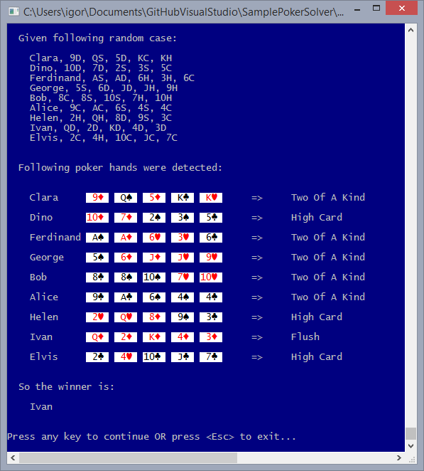

#### Sample Programming Challenge
## The Problem - Poker Hand Showdown

Implement a library (in the programming language of your choice) which evaluates who are the winner(s) among several 5 card poker hands. Note for this project that you only need to implement a subset of the regular poker hands:

    * Flush
    * Three of a Kind
    * Two of a Kind
    * High Card

### Input

Collection of players in the showdown.

    * Player Name
    * 5 Cards (each specifying the number and suit of the card)

### Output

    * Collection of winning players (more than one in case of a tie)

## Example

### Input

    * Joe, 3H, 4H, 5H, 6H, 8H
    * Bob, 3C, 3D, 3S, 8C, 10D
    * Sally, AC, 10C, 5C, 2S, 2C

### Output

    * Joe

Please state any assumptions you've made.

## DemoApp screenshot

